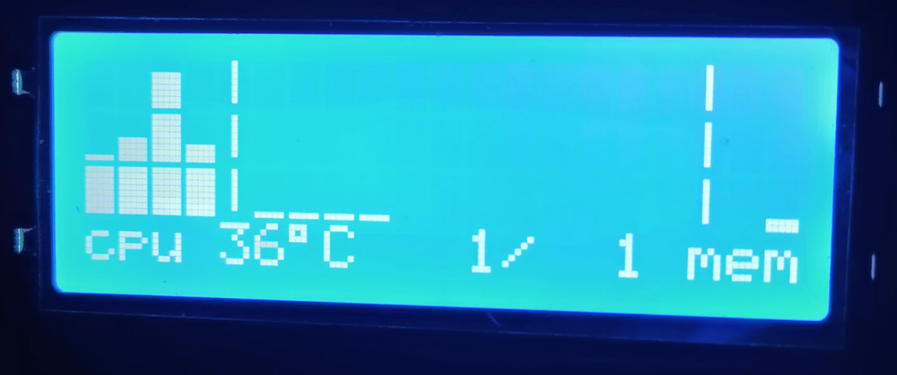

h2-net-lcd
==========

A program to drive an 20x4 I²C LCD attached to an ODROID H2 or H2+.



The display shows a number of bar gauges on lines 1-3, and the bottom line has
some additional textual info:

```
+--------------------+
|0123|aabbccddeeff| m|
|0123|aabbccddeeff| m|
|0123|aabbccddeeff| m|
|cpu 66°C 999/999 mem|
+--------------------+

0123 = non-idle percent for cpu 0,1,2,3

aa-ff: percentage of 1000 mbps network activity for up to 6 interfaces:
aa = ether0
bb = ether1
cc = ether2
dd = ether3
ee = ether4
ff = ether5
first column is transmit, second column is receive.

66°C = cpu temperature

999/999 = moving peak network mbps (any interface) over last 1 minute

m = percent of memory available
```

A few things are hard-coded which you may want to change:

in `src/main.rs`:

`NET_DEV_NAMES`: names of network interfaces to show. Defaults to `ether0` thru
`ether5`; these are custom names I set on my machine; you will probably want to
change these to something else!

in `src/lcd_display.rs`:

`I2C_BUS`: which I²C bus the display is connected to. Corresponds to
 `/dev/i2c-<n>`. Defaults to bus 2, which is on GPIO pins 18 and 20 on the
 H2+.

`I2C_ADDR`: the display's I²C address. Defaults to 0x27, which is the default
for the display sold by Hardkernel, but can be changed by solder bridging some
pads on the PCB.

## mock mode
To see the program in operation without using an actual display, build and run
with the `mock` feature enabled:

`cargo run --features mock`
